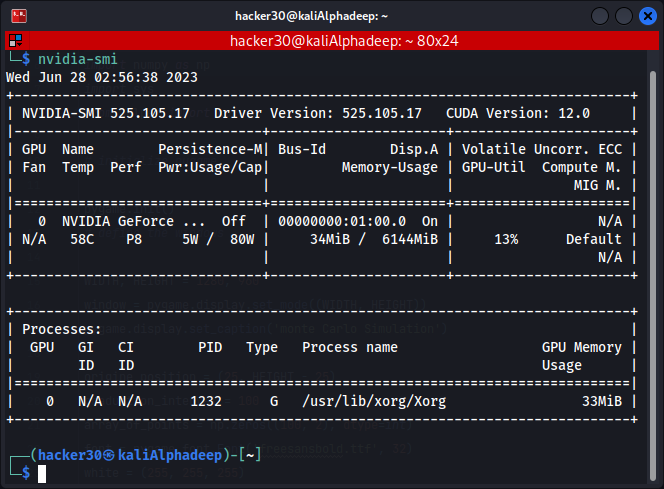
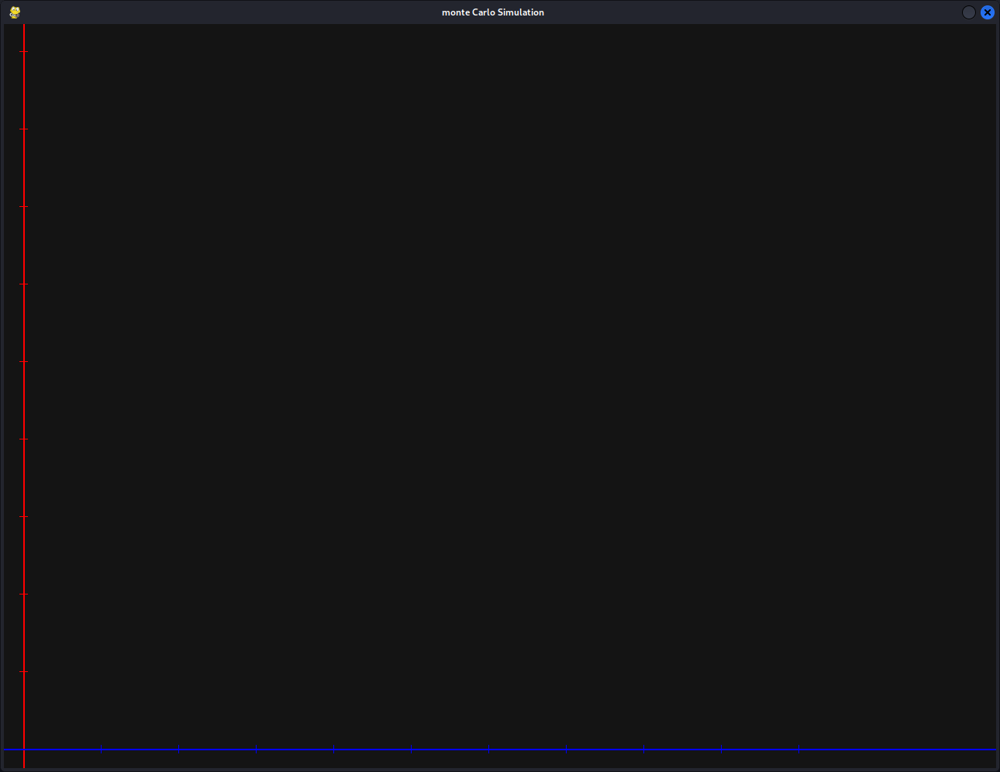
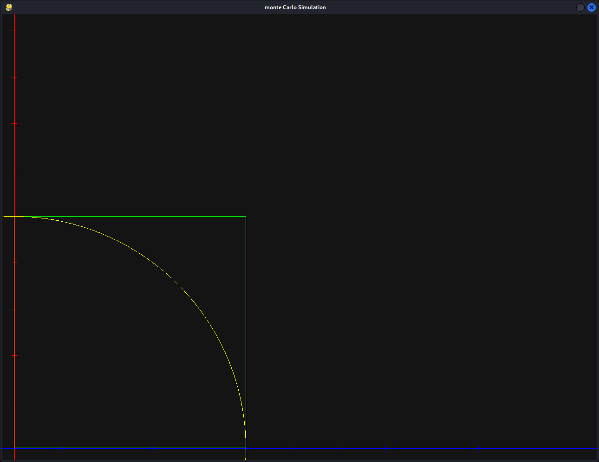
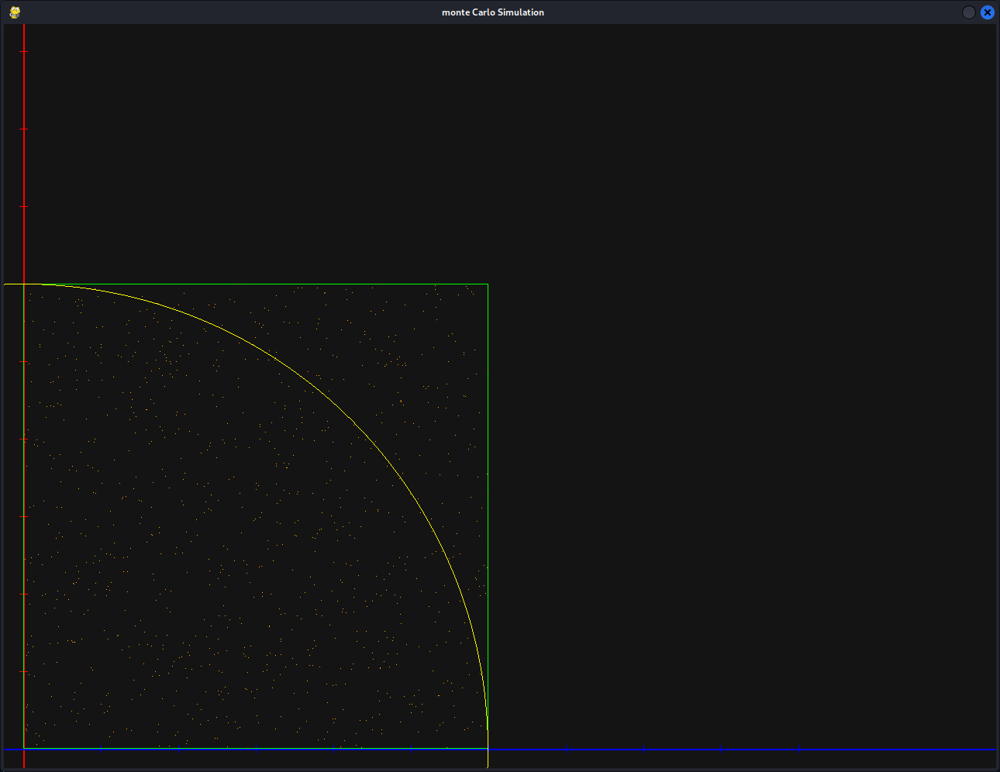
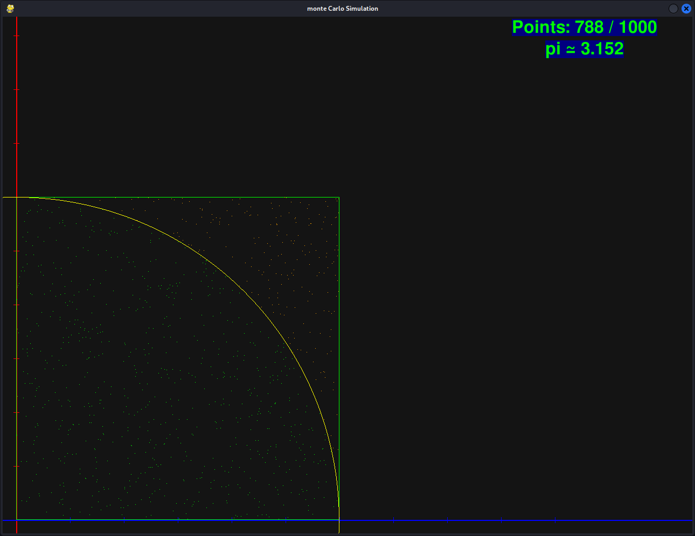
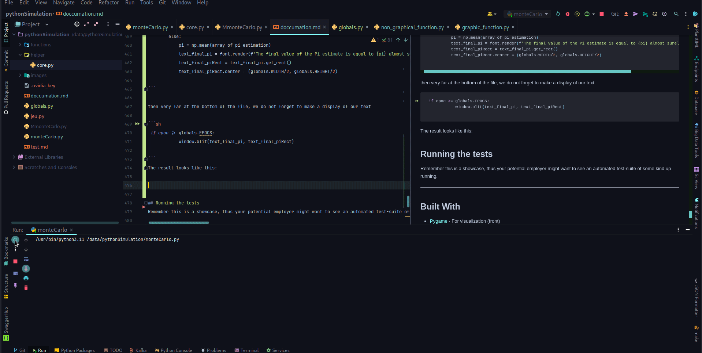

[][header-link]

# GPU Can Help Monte Carlo To Approximate The Value Of Pi
[![Project Version][version-image]][version-url]
[][Frontend-url]
[][Backend-url]

> The general idea of this dissertation is to show how to parallelize tasks and optimize our results and response times by exploiting the full power of our CPU and GPU.

So as not to be just theoretical, we're going to set ourselves a relatively simple problem situation and apply the different techniques to it.\
to make things very clear, the aim is not to beat the world record for calculating the decimals of pi, which is 100 thousand billion billionths of a digit and is currently held by *Emma Haruka Iwao* - [Developer Advocate google cloud](https://cloud.google.com/blog/products/compute/calculating-100-trillion-digits-of-pi-on-google-cloud?hl=en) (blog google).\
This record was achieved with an execution time of 157 days, 23 hours, 31 minutes and 7.651 seconds on a cluster node: n2-highmem-128 with 128 vCPUs and 864 GB RAM with a storage capacity of 663 TB.\
\
we simply want to show how to parallelize one or more repetitive tasks in order to reduce execution times. This is why our practical case which will serve as an example will be to approximate the value of pi as closely as possible using a stochastic method, in this case  🔥**Monte Carlo**🔥 will be ideal.so all our work will come down to reducing as far as possible the error made each time an estimate of pi is made.
---
## Author

**Idriss Tafo** 
* *Initial work* - [python simulation](https://github.com/idrisswill/phythonSimulation) (Repository space)
* *My professional profile on* [LinkedIn](https://www.linkedin.com/in/idriss-tchoupe-tafo-56864223a/)

## Supervisor

**Tomas Sabaliauskas** 
* professional profile on* [Research Gate](https://www.researchgate.net/profile/Tomas-Sabaliauskas/)

## Showcase

The project will be carried out as follows:

* Install necessary packages
  * check GPU
* Designed interface
  * Orthonormed and graduated coordinate system
  * Circle inscribed in the square
  * Draw points
  * Optimization
* .
* .
* .
* Technology N

## Result example

Bring the best usages of your project.

_For more examples and usage, please refer to the [Wiki][wiki]._

---

## Installation

For this demonstration, we'll assume that python is already installed on the OS of your choice and we'll just install the following libraries:

MacOS & Linux:

```sh
pip install pygame numpy matplotlib
```

---

### check GPU

check if GPU is avalaible on your systeme  

MacOS & Linux:
```sh
nvidia-smi
```
If you have an NVIDIA graphics card and the drivers are properly installed, you must have this output:


## Designed interface

Now, it is a question for us to draw a graphical interface that will allow us to have a visual feedback of our work. Obviously, this interface will not be useful to us for long. After seeing the basis of our analysis, we will no longer need an interface.

### 1)  Orthonormed and graduated coordinate system ⛥

In order to make our project modular, let's start by creating a subdirectory named *functions*🔧. In this directory we will define all the functions that will be useful to us. These functions will be separated into two files: *Graphic_function.py* and *Non-graphical_function.py*
```sh
mkdir -p "./functions" && touch "./functions/graphic_function.py" "./functions/non-graphical_function.py"
```

In the *graphic_function.py* file, we will define our first function named *draw_coordinate_system* that takes set
the coordinates of the origin of the coordinate system  *origin_coordinate*, the graduation interval *graduation_interval* and The
window where to draw *window*. This function, which returns no result, will draw the orthonormed coordinate system 
and graduate

```sh
def draw_coordinate_system(origin_coordinate, graduation_interval, window):
    width, height = pygame.display.get_surface().get_size()
    pygame.draw.line(window, "red", (origin_coordinate[0], 0), (origin_coordinate[0], height), 2)
    pygame.draw.line(window, "blue", (0, origin_coordinate[1]), (width, origin_coordinate[1]), 2)
    x = 0
    # draw graduation
    while x < height - origin_coordinate[0]:
        x += graduation_interval
        pygame.draw.line(window, "red", (origin_coordinate[0] + 5, origin_coordinate[1] - x), (origin_coordinate[0] - 5, (origin_coordinate[1] - x)), 1)
        pygame.draw.line(window, "blue", (origin_coordinate[0] + x, origin_coordinate[1] - 5), (origin_coordinate[0] + x, (origin_coordinate[1] + 5)), 1)

```
in the main file *monteCarlo.py* we define the basic structure of our project, We call on the functions defined above.

```sh
from functions import non_graphical_function, graphic_function
import pygame
import sys


# initialize pygame

pygame.init()
# define the windows

WIDTH, HEIGHT = 1280, 960
window = pygame.display.set_mode((WIDTH, HEIGHT))
pygame.display.set_caption('monte Carlo Simulation')

ORIGIN_COORDINATE = (25, HEIGHT - 25)
GRADUATION_INTERVAL = 100
run = True
fps = 60
clock = pygame.time.Clock()

if __name__ == "__main__":
    while run:
        # handling input
        for event in pygame.event.get():
            if event.type == pygame.QUIT:
                run = False
                break
            # update
            # visuals
        window.fill((20, 20, 20))
        graphic_function.draw_coordinate_system(ORIGIN_COORDINATE,GRADUATION_INTERVAL, window)
        # updating the windows
        pygame.display.flip()
        clock.tick(fps)
    pygame.quit()
```
By executing the main file *monteCarlo.py*, we normally have something that looks like this image for illustration


### 2)  Circle inscribed in the square ⛥

For the rest, it is a question for us to draw a circle inscribed in a square. As we are called to use this figure
an infinite number of times, it would be more accurate for us to define a function for this task.\
in the *graphic_function.py* file, We therefore define the *draw_square_and_circle* function which takes as argument the radius *raduis* of the circle to be drawn and 
the window *windoow* where we will draw and coordinate of center of circle. As a reminder, the radius must be an integer and multiple of the graduation interval

```sh

def draw_square_and_circle(radius, center, window):
    '''
    :param window: window where we can draw fig
    :param center: the center of circle
    :param radius: t is an integer for multiply graduation interval
    :return: void
    '''
    
    square = pygame.Rect(center[0], center[1] - radius, radius, radius)
    pygame.draw.rect(window, "green", square, 1)
    pygame.draw.circle(window, 'yellow', center, radius, 1)


```
So if we call on our new function in our main file like thhis, **graphic_function.draw_square_and_circle(5*GRADUATION_INTERVAL, ORIGIN_COORDINATE, window)**, we will have this:




### 3)  Draw points ⛥

For the rest, we will randomly and uniformly generate points on our figure You are already starting to get used to the
functions I hope well. In order to separate the logic from the graphic rendering, this function will have this special
that she will not generate points, but she will just take a table of coordinates and will take care of drawing them on 
the chosen window. So in our *graphic_function.py* file, let's define the *draw_points* function that takes as an argument
The point coordinate array *array_of_coordinates*, the window *window* and is responsible for drawing them.
```sh

def draw_points(array_of_points, window):
    '''
        :param array_of_points: the array of coordinates of the points to draw
        :param window: window where we can draw
        :return: void
        '''
    for point in array_of_points:
        pygame.draw.line(window, 'orange', tuple(point), tuple(point))

```

For now, this function seems quite simplistic, but believe me we will come back to it.\
\
Now, in our main function, we will create this coordinate array with just 1000 points For example.\
Always keep in mind that these points will be inside the square. This is why we need at any time to know the length
of the dimension of the square which is also the radius of the circle and it is the quarter circle inscribed in the
square that interests us
```sh
size_of_square = 6 * GRADUATION_INTERVAL
array_of_point = np.random.randint((ORIGIN_COORDINATE[0], ORIGIN_COORDINATE[1] - size_of_square),
                                           (ORIGIN_COORDINATE[0] + size_of_square, ORIGIN_COORDINATE[1]),
                                           size=(1000, 2))

```

After updating, the main file *monteCarlo.py* will look like this:

```shell
import time
from functions import non_graphical_function, graphic_function
import matplotlib.pyplot as plt
import pygame
import math
import numpy as np
import sys
from helper import core

# initialize pygame

pygame.init()
# define the windows

WIDTH, HEIGHT = 1280, 960
window = pygame.display.set_mode((WIDTH, HEIGHT))
pygame.display.set_caption('monte Carlo Simulation')

ORIGIN_COORDINATE = (25, HEIGHT - 25)
GRADUATION_INTERVAL = 100
run = True
fps = 60
clock = pygame.time.Clock()
size_of_square = 6 * GRADUATION_INTERVAL
array_of_point = np.random.randint((ORIGIN_COORDINATE[0], ORIGIN_COORDINATE[1] - size_of_square),
                                           (ORIGIN_COORDINATE[0] + size_of_square, ORIGIN_COORDINATE[1]),
                                           size=(1000, 2))

if __name__ == "__main__":
    while run:
        # handling input
        for event in pygame.event.get():
            if event.type == pygame.QUIT:
                run = False
                break
            # update
            # visuals
        window.fill((20, 20, 20))
        graphic_function.draw_coordinate_system(ORIGIN_COORDINATE,GRADUATION_INTERVAL, window)
        graphic_function.draw_square_and_circle(6*GRADUATION_INTERVAL, ORIGIN_COORDINATE, window)
        graphic_function.draw_points(array_of_point, window)
        # updating the windows
        pygame.display.flip()
        clock.tick(fps)
    pygame.quit()

  
```
And at runtime, the output looks like this:



The next action is to count the dots inside the circle and color them differently.\
Why do we have to do this?\
Well remember that we want to estimate the value of the number pi and to do this,
A little gymnastics is required:

Let $ABCD$ a **square** side $a$, and $\left(\mathscr C\right)$ the **circle** center **C** and 
radius $r = a$ (i.e. a quarter of the circle is inscribed in the square).\ If we randomly and 
uniformly throw dots on the $ABCD$ square, then the proportion of points belonging to the *quarter* 
circle $\left(\mathscr C\right)$ written in $ABCD$ is proportional to its area
$\mathscr A_\text{quartDisque} = \dfrac{\pi r^2}{4}$.\
c'est a dire:\
\
$\dfrac{N_\text{PointsOnTheCircle}}{N_\text{total}} ≃ \dfrac{A_\text{quartDisque}}{A_\text{square}} $\
$\dfrac{N_\text{PointsOnTheCircle}}{N_\text{total}} ≃ \dfrac{\dfrac{\pi r^2}{4}}{r^2}$\
$\dfrac{N_\text{PointsOnTheCircle}}{N_\text{total}} ≃ \left(\dfrac{\pi r^2}{4}\right) \times \left(\dfrac{1}{r^2}\right)$\
$\dfrac{N_\text{PointsOnTheCircle}}{N_\text{total}} ≃ \dfrac{\pi}{4}$\
$\pi ≃ \dfrac{4 \times N_\text{PointsOnTheCircle}}{N_\text{total}}$

Now, one of our aims is to find $N_\text{PointsOnTheCircle}$ and assign them a colour
To do this, bear in mind that a point is considered to belong to a quarter circle if the distance between the centre of the circle and the point in question is less than the radius of the circle.
the centre of the circle and the point in question is less than the radius of the circle.
In the *non-graphical_function.py*🐍 file , we define the *calculate_distance*📏 function  which takes as its arguments
 02 points $P1$ and $P1$ and returns the Euclidean distance between the two points.
```sh
def calculate_distance(p1, p2):
    return math.sqrt((p2[1] - p1[1]) ** 2 + (p2[0] - p1[0]) ** 2)

```

As the value of the distance we've just calculated isn't directly useful, we'll define another function in the same python file,
we'll define another function in the same python file 🐍 called *is_it_in_the_circle*🤔, which this time returns a boolean value that tells us whether or not a point is on the quarter circle.
Boolean value, this time telling us whether a point is on the quarter circle.
you'll see the importance of this function later.


```sh

def is_it_in_the_circle(p):
    '''
    :param p: it is the coordinate for random point
    :return: 0 if point is in circle and 1 if else
    '''
    distance = calculate_distance(p, ORIGIN_COORDINATE)
    return 0 if distance < SIZE_OF_SQUARE * GRADUATION_INTERVAL else 1


```

It's important that this function takes only one argument, so it would be a little easier 
to use it as an aggregation function.\

If we try to integrate our new function into the main function of our program, we'll get errors due to the fact that we're using global variables.
to correct this, we're going to create a new python file called *globals.py*, in which we'll declare all the variables that will be global to our programme


```sh

def initialize(): 
    global ORIGIN_COORDINATE
    global SIZE_OF_SQUARE
    global GRADUATION_INTERVAL
    global WIDTH
    global HEIGHT
    
    WIDTH, HEIGHT = 1280, 960
    ORIGIN_COORDINATE = (25, HEIGHT - 25)
    GRADUATION_INTERVAL = 100
    SIZE_OF_SQUARE = 6
```
Now that the global varialbles are correctly defined, it will be enough to import them to use them wherever you want.\
As we are able to tell whether a point belongs to the circle, thanks to the function *is_it_in_the_circle*, then modify 
the *draw_points* function to color them.\
We can add as an argument another array named *is_in_circle* of the same size as the array of coordinate *array_of_points*
and containing only $0$ and $1$ and then make it possible to tell if the point of the table *array_of_points* with the
index $i$ belongs to the circle $\left(\mathscr C\right)$

```sh

def draw_points(array_of_points, is_in_circle, window):
    '''
        :param array_of_points: the array of coordinates of the points to draw
        :param is_in_circle: the array of boolean to know if point is in circle
        :param window: window where we can draw
        :return: void
        '''
    for idx, x in enumerate(array_of_points):
        if is_in_circle[idx] == 0:
            pygame.draw.line(window, 'green', tuple(x), tuple(x))
        else:
            pygame.draw.line(window, 'orange', tuple(x), tuple(x))
```

Now let's integrate all this into our main function and observe the results. By the way, we can integrate a Little text 
such as the total number of points, the number of points in the circle, an extimation of $\pi$ and others.\
So our main function looks like this.

```sh
import time
from functions import non_graphical_function, graphic_function
import globals
import matplotlib.pyplot as plt
import pygame
import math
import numpy as np
import sys
from helper import core

# initialize pygame

pygame.init()
globals.initialize()
# define the windows


window = pygame.display.set_mode((globals.WIDTH, globals.HEIGHT))
pygame.display.set_caption('monte Carlo Simulation')

run = True
fps = 60
clock = pygame.time.Clock()
font = pygame.font.Font('freesansbold.ttf', 32)
# define color of text
white = (255, 255, 255)
green = (0, 255, 0)
blue = (0, 0, 128)

size_of_square = 6 * globals.GRADUATION_INTERVAL
array_of_point = np.random.randint((globals.ORIGIN_COORDINATE[0], globals.ORIGIN_COORDINATE[1] - size_of_square),
                                           (globals.ORIGIN_COORDINATE[0] + size_of_square, globals.ORIGIN_COORDINATE[1]),
                                           size=(globals.N_TOTAL, 2))

is_in_circle = np.array(list(map(non_graphical_function.is_it_in_the_circle, array_of_point)))
unique, counts = np.unique(is_in_circle, return_counts=True)
value_count = dict(zip(unique, counts))
pi_estimate = 4 * value_count[0] / globals.N_TOTAL
if __name__ == "__main__":
    while run:
        # handling input
        for event in pygame.event.get():
            if event.type == pygame.QUIT:
                run = False
                break
        # update
        # visuals
        window.fill((20, 20, 20))
        graphic_function.draw_coordinate_system(globals.ORIGIN_COORDINATE, globals.GRADUATION_INTERVAL, window)
        graphic_function.draw_square_and_circle(6*globals.GRADUATION_INTERVAL, globals.ORIGIN_COORDINATE, window)
        graphic_function.draw_points(array_of_point, is_in_circle, window)
        text = font.render(f'Points: {value_count[0]} / {globals.N_TOTAL}', True, green, blue)
        text_pi = font.render(f'pi ≃ {pi_estimate}', True, green, blue)
        textRect = text.get_rect()
        pi_textRect = text_pi.get_rect()
        textRect.center = (globals.WIDTH - 200, 20)
        pi_textRect.center = (globals.WIDTH - 200, 60)
        window.blit(text, textRect)
        window.blit(text_pi, pi_textRect)
        # updating the windows
        pygame.display.flip()
        clock.tick(fps)
    pygame.quit()

```
And as a result, we have this:



The Secret of **Monte Carlo** lies in the fact that it is enough to repeat an action a number of times
close to infinity, and the average result will be close to verity almost, surely. Our next task is 
therefore to make loop, our result a finite number of times, but very large to approach the theory of
**Monte Carlo**🔒

To do this, we will start by defining a global variable *EPOCS* which defines the number of times we
must iterate, then in the infinite loop of the game, we will make a block in the following order:
- Random generation of coordinates
- Calculates the distance between these points and the origin of the coordinate system which is the center of the circle
- County of points within the circle
- Make an estimate of Pi
- Saving the Exestimer value of pi in an array

Each time, we count the number of times we have executed the block and whether it is greater than or 
equal to the value of the global variable *EPOCS* then we stop and calculate the average of the
recorded results in the result table, and we display this average value which is the value of our $\pi$ search.\
Let's declare our global variable in the *global.py*. For the moment it can be fixed a value of $1000$. We'll come back to that later.

```sh
 global EPOCS
 EPOCS = 1000
```

In the main function, we define our block like this.
```sh

        if epoc < globals.EPOCS:
            array_of_point = np.random.randint(
                (globals.ORIGIN_COORDINATE[0], globals.ORIGIN_COORDINATE[1] - size_of_square),
                (globals.ORIGIN_COORDINATE[0] + size_of_square, globals.ORIGIN_COORDINATE[1]),
                size=(globals.N_TOTAL, 2))

            is_in_circle = np.array(list(map(non_graphical_function.is_it_in_the_circle, array_of_point)))
            unique, counts = np.unique(is_in_circle, return_counts=True)
            value_count = dict(zip(unique, counts))
            pi_estimate = 4 * value_count[0] / globals.N_TOTAL
            array_of_pi_estimation = np.append(array_of_pi_estimation, [pi_estimate])
        else:
            pi = np.mean(array_of_pi_estimation)
            text_final_pi = font.render(f'The final value of the Pi estimate is equal to {pi} almost surely', True, green, blue)
            text_final_piRect = text_final_pi.get_rect()
            text_final_piRect.center = (globals.WIDTH/2, globals.HEIGHT/2)

```

then very far at the bottom of the file, we do not forget to make a display of our text

```sh
 if epoc >= globals.EPOCS:
            window.blit(text_final_pi, text_final_piRect)

```
The result looks like this:



### 4)  optimization ⛥


## Running the tests
Remember this is a showcase, thus your potential employer might want to see an automated test-suite of some kind up running.

---

## Built With
* [Pygame](https://www.pygame.org/docs/) - For visualization (front)
* [Python](https://docs.python.org/) - Backend
* [numpy](https://numpy.org/) - Backend
* [Nvidia Cuda](https://developer.nvidia.com/cuda-downloads) - Dependency Management


## Release History


* 0.0.1
    * Initial work

---

## Contributing

1. Fork it (<https://github.com/yourname/yourproject/fork>)
2. Create your feature branch (`git checkout -b feature/fooBar`)
3. Commit your changes (`git commit -am 'Add some fooBar'`)
4. Push to the branch (`git push origin feature/fooBar`)
5. Create a new Pull Request

<!-- Markdown link & img dfn's -->

[header-url]: github-template.png
[header-link]: https://github.com/alexandrerosseto

[repository-url]: https://github.com/alexandrerosseto/wbshopping

[cloud-provider-url]: https://wbshopping.herokuapp.com

[linkedin-url]: https://www.linkedin.com/in/alexandrerosseto

[wiki]: https://github.com/yourname/yourproject/wiki

[version-image]: https://img.shields.io/badge/Version-1.0.0-brightgreen?style=for-the-badge&logo=appveyor
[version-url]: https://img.shields.io/badge/version-1.0.0-green
[Frontend-image]: https://img.shields.io/badge/Frontend-Ionic-blue?style=for-the-badge
[Frontend-url]: https://img.shields.io/badge/Frontend-Ionic-blue?style=for-the-badge
[Backend-image]: https://img.shields.io/badge/Backend-Java%208-important?style=for-the-badge
[Backend-url]: https://img.shields.io/badge/Backend-Java%208-important?style=for-the-badge